# Hospital Appointment Management System

A web-based Hospital Appointment Management System built using Django.
This system allows patients to book appointments on online and enables doctors/admin to manage schedules efficiently.

## Project Description

The Hospital Appointment Management System is designed to simplify the process of booking and managing hospital appointments.

### It helps:
    
    - Patients book appointments online
    
    - Doctors manage their schedules
    
    - Admin monitor hospital activities
    
    - Reduce manual paperwork

## Features

    - Patient Registration & Login
    
    - Doctor Registration & Management
    
    - Book Appointment
    
    - Appointment Approval / Cancellation
    
    - Admin Dashboard
    
    - Database Management using SQLite
    
    - Secure Authentication System

## Technologies Used

    - Backend: Python, Django (MTV Architecture) 
    
    - Frontend: HTML5, CSS3, JavaScript (Bootstrap 5, BI Icons) 
    
    - Database: PostgreSQL / SQLite / MySQL 
    
    - Reporting: ReportLab (PDF Engine) 
    
    - Data Handling: Pandas & NumPy (Core analytics logic) 

    - Environment: Pip-managed dependencies (Standardized via requirements.txt) 

## Installation & Setup

### step 1: Clone the Repository

    git clone https://github.com/KAVINPRABHAKAR/Hospital_Appointment_Management_System.git

### Step 2: Navigate to Project Directory

    cd Hospital_Appointment_Management_System

### Step 3: Create Virtual Environment

    python -m venv venv

### Step 4: Activate Virtual Environment

    venv\Scripts\activate

### Step 5: Install Required Dependencies

    pip install -r requirements.txt

    If requirements.txt is not available, install Django manually

    pip install django

### Step 6: Apply Database Migrations

    python manage.py makemigrations
    
    python manage.py migrate

### Step 7: Create Superuser (Admin Login)

    python manage.py createsuperuser

    Enter username, email, and password when prompted.

### Step 8: Run the Development Server

    python manage.py runserver

### Step 9: Open in Browser

    Admin Panel

    http://127.0.0.1:8000/admin/

### Now you can:
    
    - Access Admin Panel 
    
    - Register Doctors

    - Register Hospital Departments

    - Register & Manage Appointments

    - Login as Doctor 

### Step 10: Open in Browser
   
    Main Application

    http://127.0.0.1:8000/

### Now you can See:

    - Login Page

    - Dashboard Page

    - Register New Patient Page

    - Search Patient Page 

    - Doctor Wise Queues Page

    - Doctor Wise Analytics Page

    - Daily OPD Reports Page

    - Logout Option

## Output Screenshots

### Admin Page

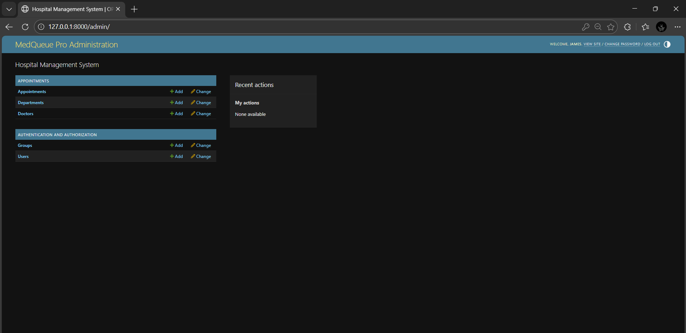

### Add Hospital Departments

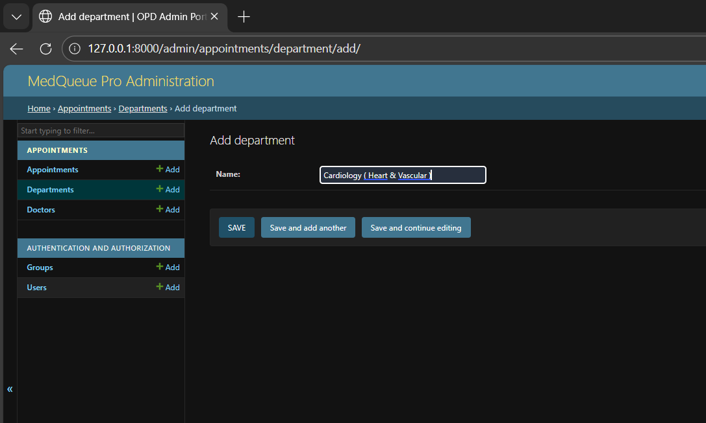

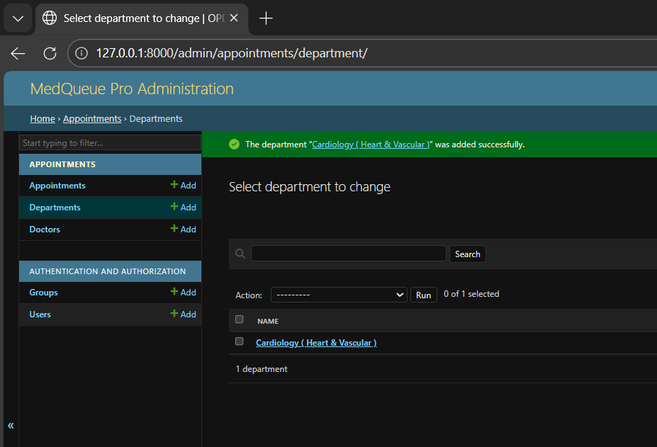

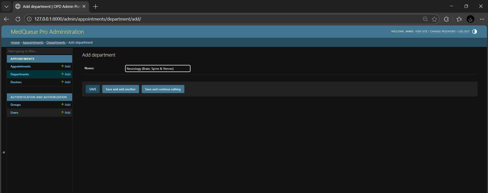

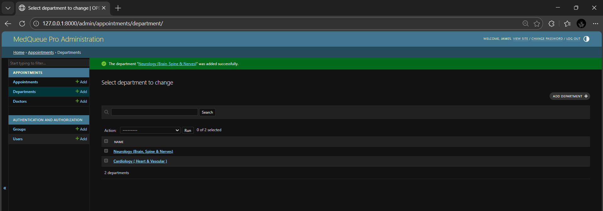

### Add Doctors

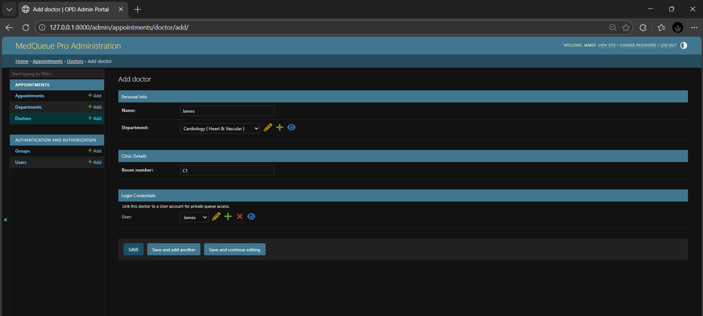

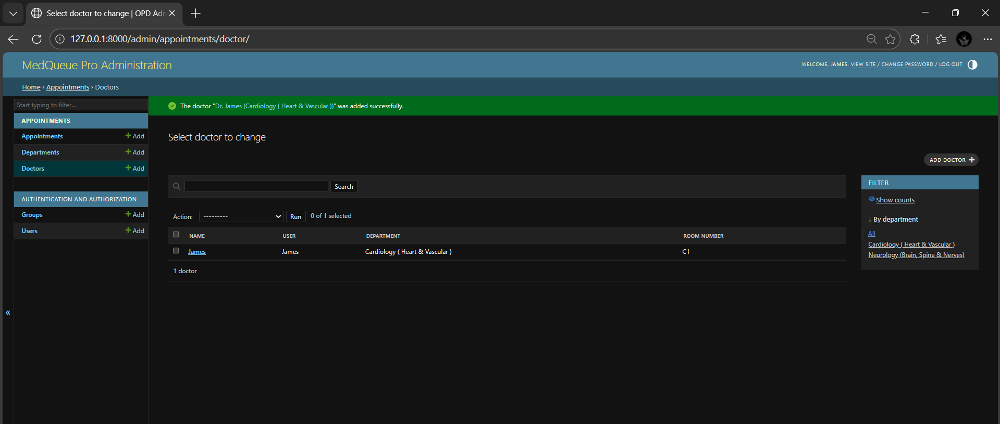

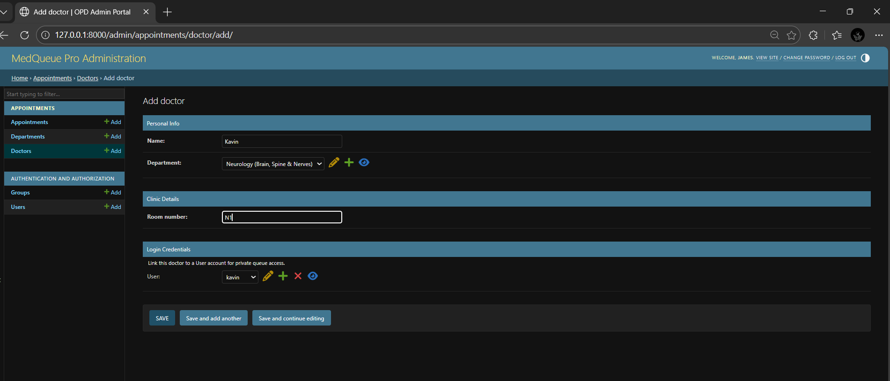

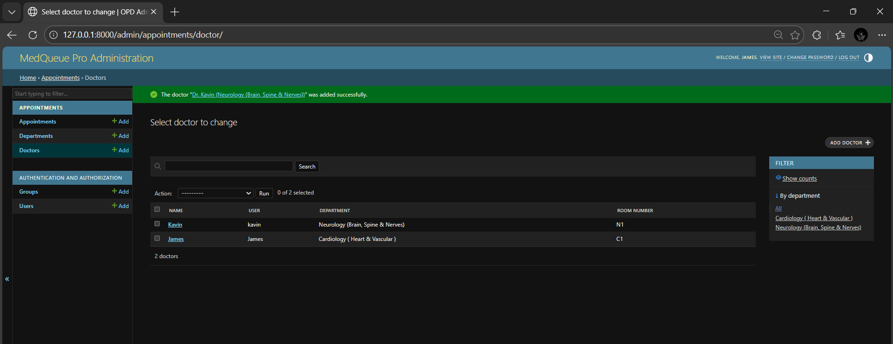

### Login Page

### Dashboard Page Before Patient Registration

### Patient Registration

### Dashboard Page After Patient Registration

### Doctor Queues

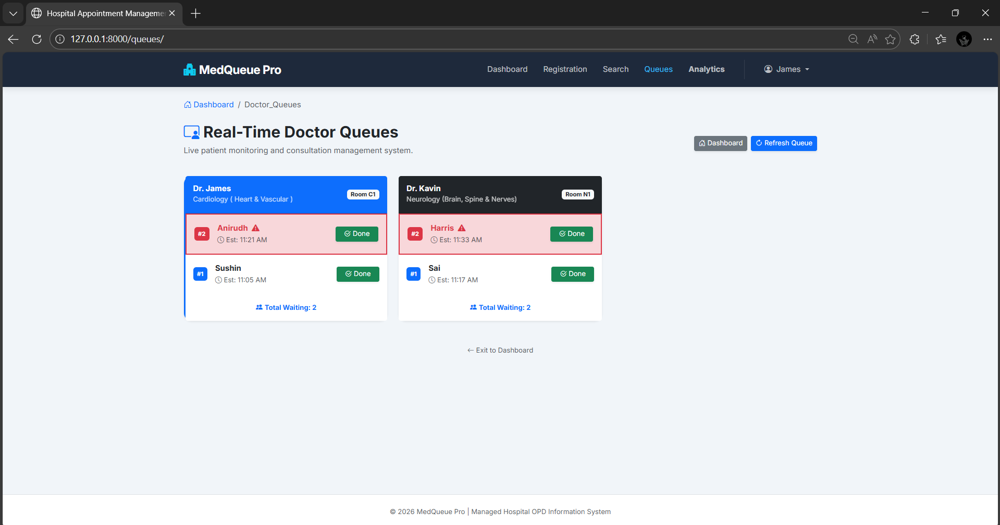

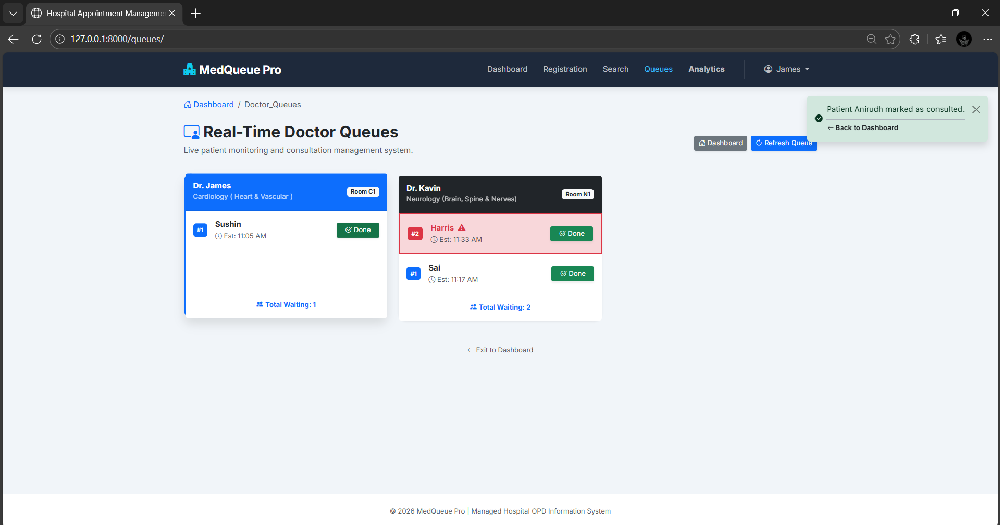

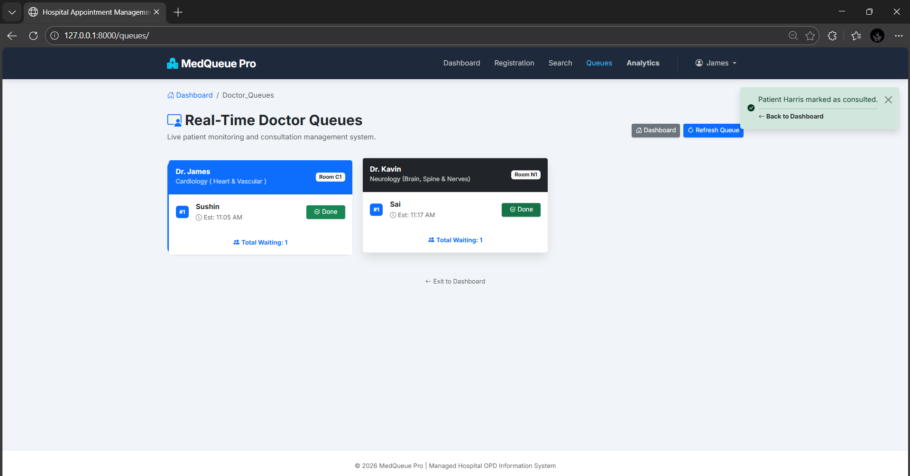

### Doctor Wise Analytics

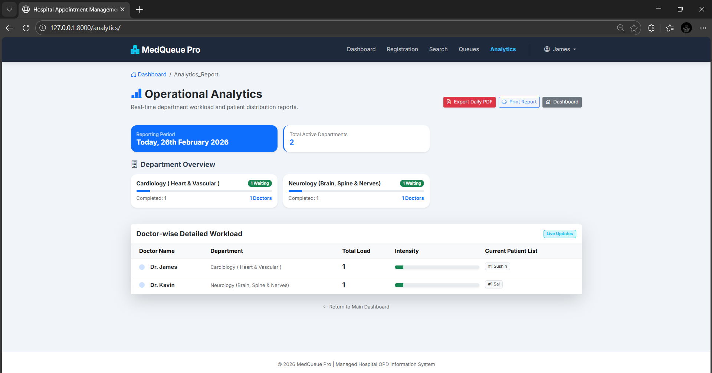

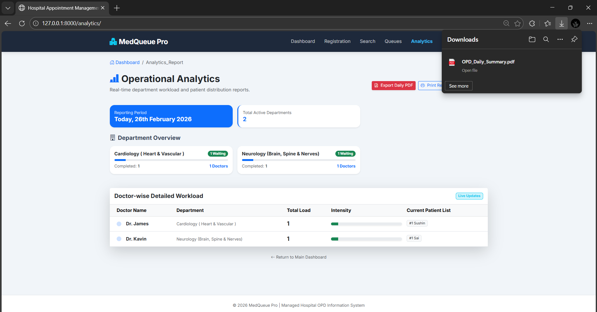

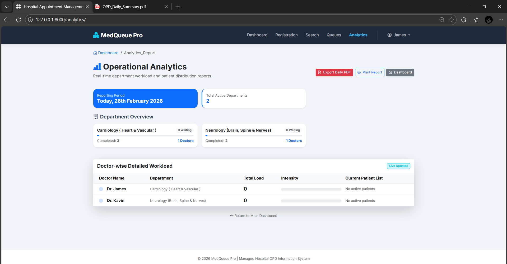

### Search Patient Catlog

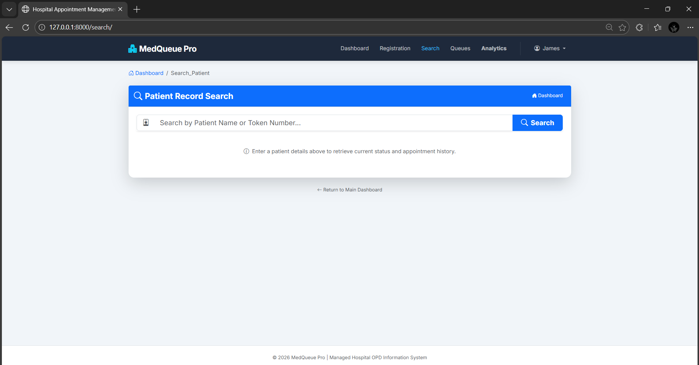

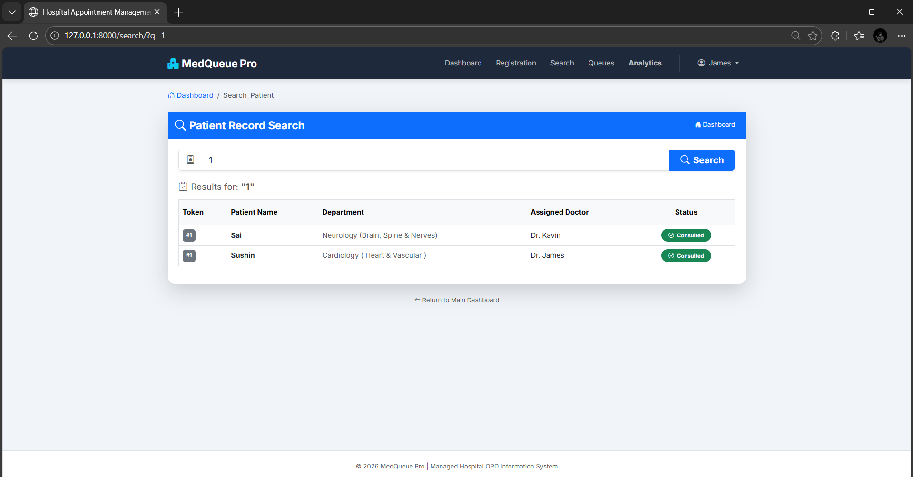

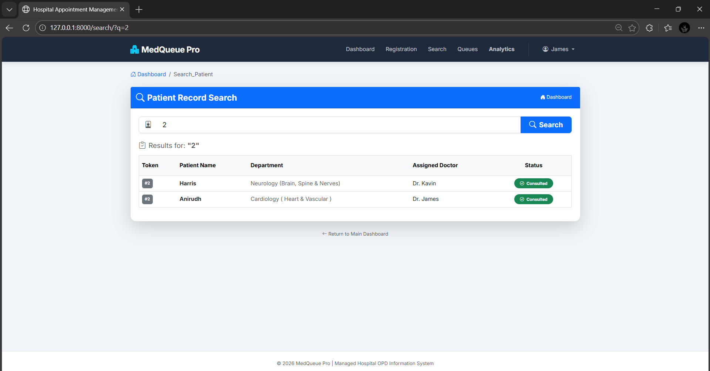

### Daily OPD Pdf Report

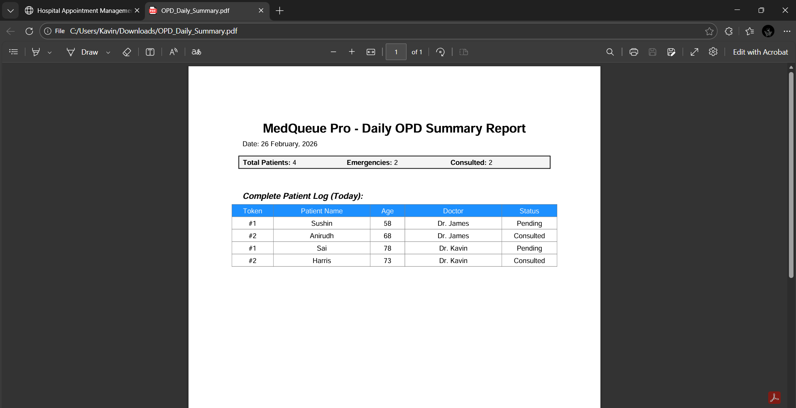

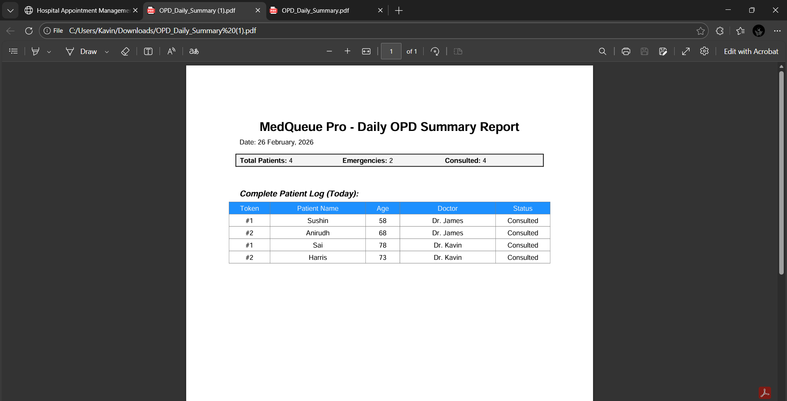

