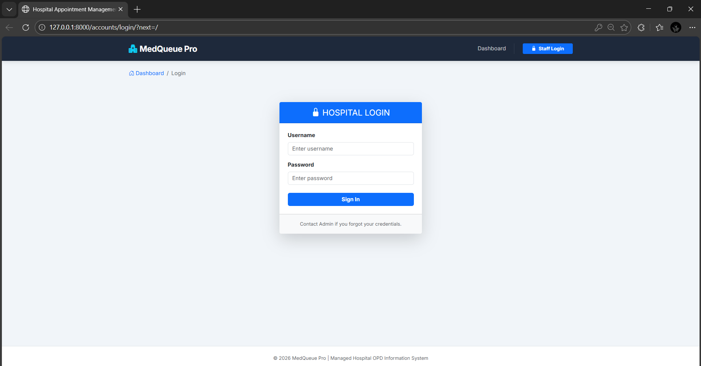
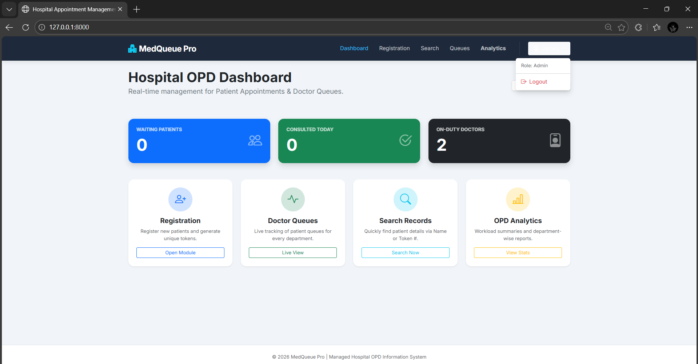
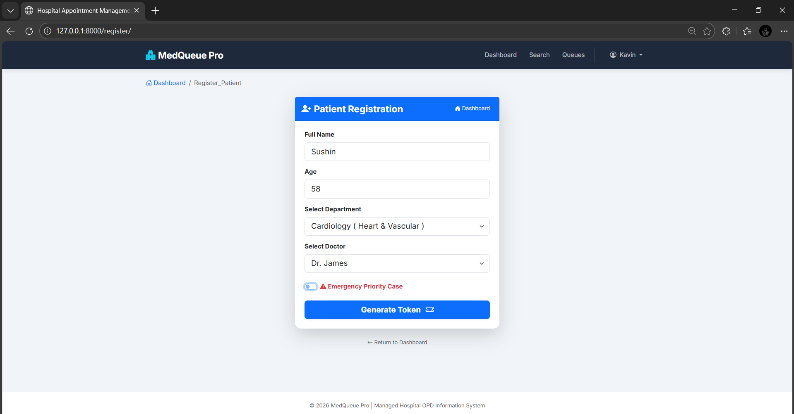
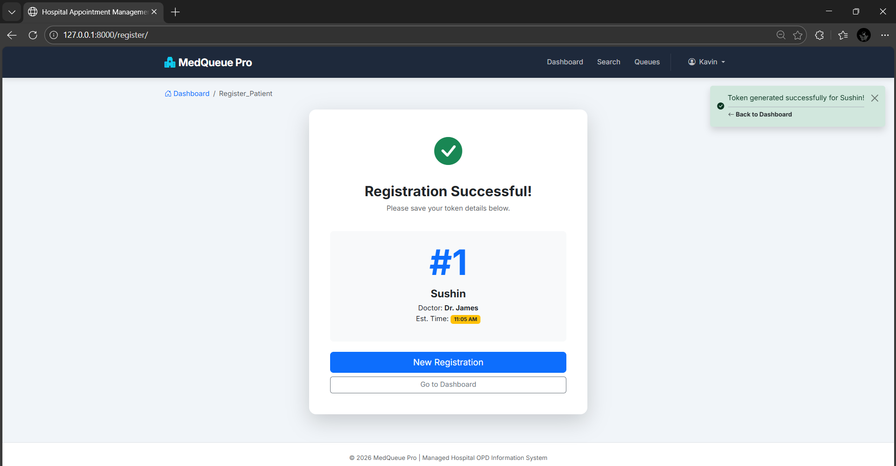
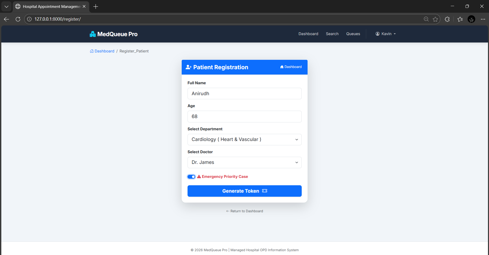
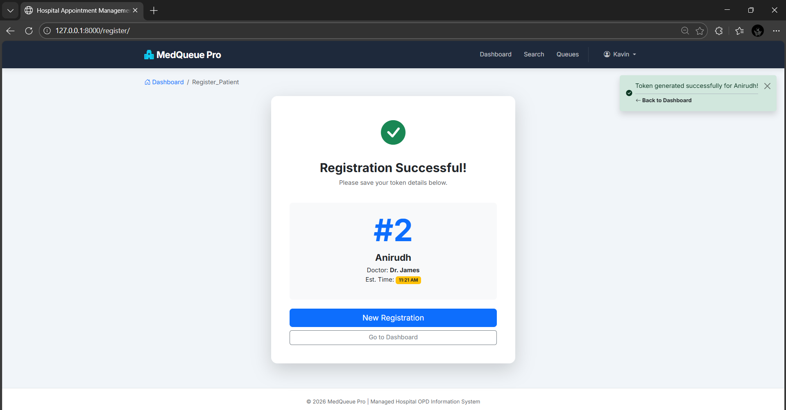
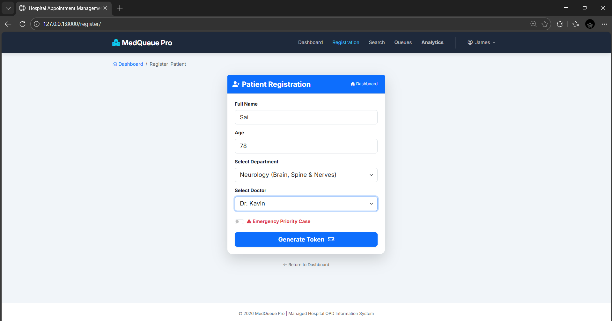
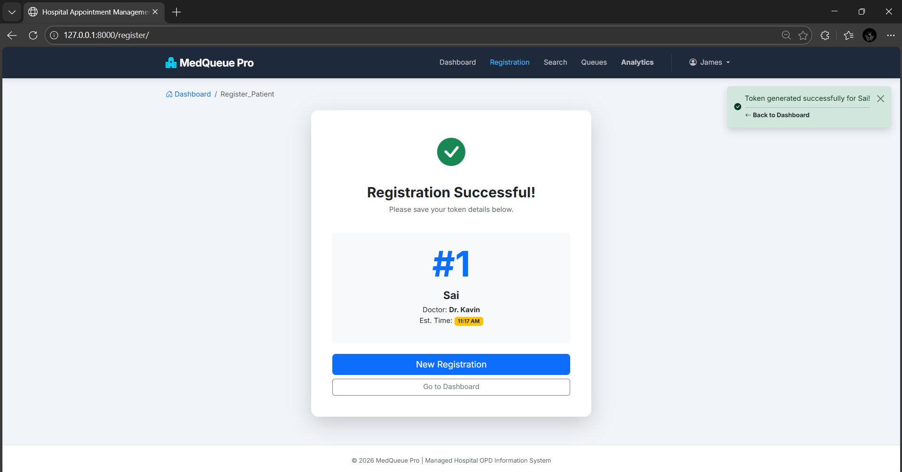
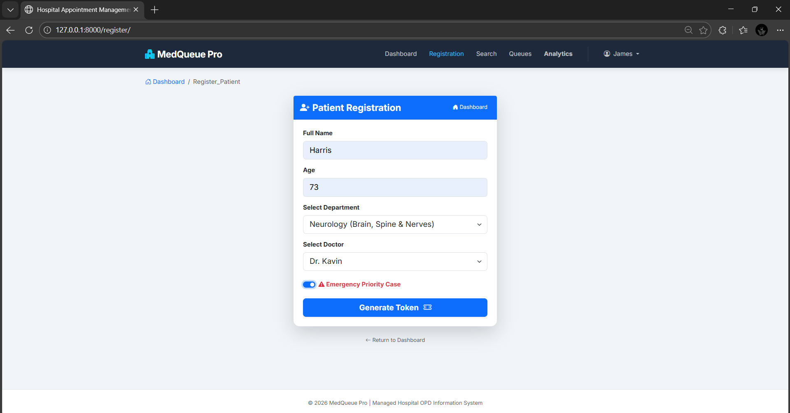
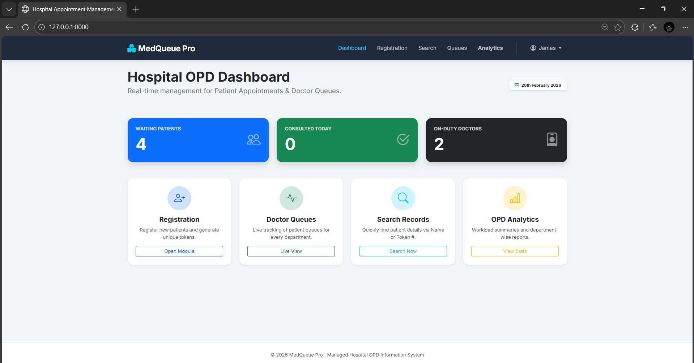

# Hospital Appointment Management System

A web-based Hospital Appointment Management System built using Django.
This system allows patients to book appointments online and enables doctors/admin to manage schedules efficiently.

## Project Description

The Hospital Appointment Management System is designed to simplify the process of booking and managing hospital appointments.

### It helps:
    - Patients book appointments online
    
    - Doctors manage their schedules
    
    - Admin monitor hospital activities
    
    - Reduce manual paperwork

This project demonstrates backend logic, database handling, and full-stack web development using Django.

## Features

    - Patient Registration & Login
    
    - Doctor Registration & Management
    
    - Book Appointment
    
    - Appointment Approval / Cancellation
    
    - Admin Dashboard
    
    - Database Management using SQLite
    
    - Secure Authentication System

## Technologies Used

    - Backend: Python, Django (MTV Architecture) 
    
    - Frontend: HTML5, CSS3, JavaScript (Bootstrap 5, BI Icons) 
    
    - Database: PostgreSQL / SQLite / MySQL 
    
    - Reporting: ReportLab (PDF Engine) 
    
    - Data Handling: Pandas & NumPy (Core analytics logic) 

## ⚙️ Installation & Setup

### step 1: Clone the Repository

    git clonehttps://github.com/KAVINPRABHAKAR/Hospital_Appointment_Management_System.git

### Step 2: Navigate to Project Directory

    cd Hospital_Appointment_Management_System

### Step 3: Create Virtual Environment

    python -m venv venv

### Step 4: Activate Virtual Environment

    venv\Scripts\activate

### Step 5: Install Required Dependencies

    pip install -r requirements.txt

    If requirements.txt is not available, install Django manually:

    pip install django

### Step 6: Apply Database Migrations

    python manage.py makemigrations
    python manage.py migrate

### Step 7: Create Superuser (Admin Login)

    python manage.py createsuperuser

    Enter username, email, and password when prompted.

### Step 8: Run the Development Server

    python manage.py runserver

### Step 9: Open in Browser

    Main Application

    http://127.0.0.1:8000/

    Admin Panel

    http://127.0.0.1:8000/admin/

## Project Successfully Running

### Now you can:
    - Register as Patient

    - Login as Doctor

    - Manage Appointments

    - Access Admin Panel

## Output Screenshots

## Output Screenshots

